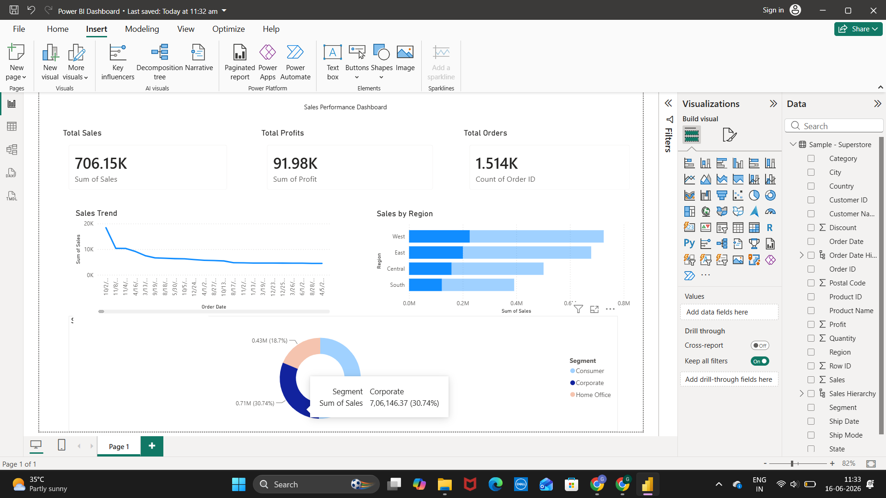

# 📊 Sales Performance Dashboard

An interactive Power BI dashboard built using the Superstore dataset to analyze sales performance, profitability, customer segments, and regional trends.

---

## 🚀 Project Overview

This project provides business insights through data visualization and KPI tracking. The dashboard helps stakeholders monitor sales performance, identify profitable regions, and understand customer purchasing behavior.

---

## 🎯 Business Objectives

- Track overall sales performance
- Monitor profit generation
- Analyze regional sales distribution
- Understand customer segment contribution
- Support data-driven business decisions

---

## 🛠️ Tools & Technologies

- Power BI
- SQL
- Excel / CSV
- Data Visualization
- Business Analytics

---

## 📈 Dashboard Features

### KPI Cards
- Total Sales
- Total Profit
- Total Orders

### Sales Trend Analysis
- Track sales performance over time
- Identify growth and decline patterns

### Regional Analysis
- Compare sales across regions
- Identify top-performing markets

### Customer Segmentation
- Analyze Consumer, Corporate, and Home Office segments
- Measure contribution of each segment to total sales

---

## 📷 Dashboard Preview



---

## 📂 Project Structure

```text
sales-performance-dashboard/
│
├── data/
│   └── Sample-Superstore.csv
│
├── sql/
│   └── analysis_queries.sql
│
├── powerbi/
│   └── Power Dashboard.pbix
│
├── screenshots/
│   └── dashboard_page1.png
│
├── insights/
│   └── business_findings.md
│
└── README.md
```

---

## 🔍 Key Insights

- West region generated the highest sales revenue.
- Consumer segment contributed the largest share of sales.
- Sales performance varied significantly across regions.
- Profitability trends indicate opportunities for targeted growth strategies.

---

## 💡 Future Improvements

- Add interactive filters and slicers
- Build forecasting models
- Create drill-through reports
- Integrate live database connections

---

## 👨‍💻 Author

**Sujith**

GitHub: https://github.com/GothamSujith
